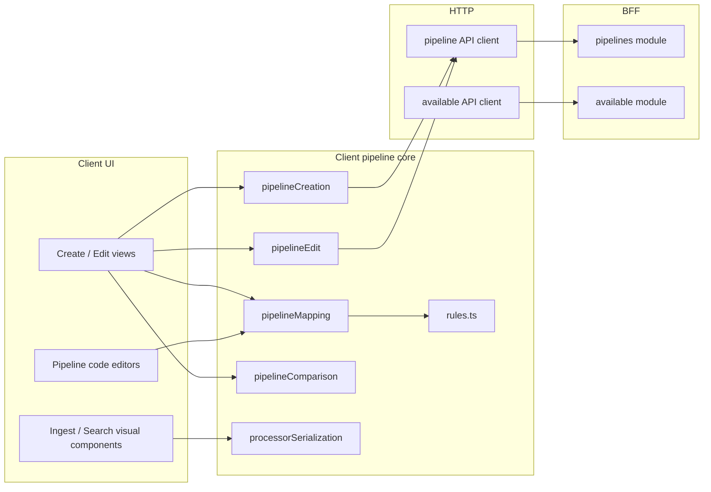

# Flava vector search pipeline skill

This skill orients you around one of the most coupled areas of **product-dbs-for-vector-search**: the pipeline builder shares types, dynamic forms, backend-shaped JSON, and several parallel code paths (create, edit, visual, code, simulate, compare).

## Product scope

- **App root:** `apps/product-dbs-for-vector-search/`
- **Client:** `client/` — Vue 3; main logic under `client/src/utils/pipeline/`, views under pages for create/edit pipeline.
- **BFF:** `bff/` — NestJS; forwards to vector-search backend under `bff/src/modules/pipelines` and exposes **processor definition** proxies under `bff/src/modules/available`.

If the ticket is about another Flava app, this skill is only partial context.

## Mental model

A **pipeline** (product concept) includes:

1. **Basic info** — name, description, creation mode (visual vs code).
2. **Index** — template vs manual, fields, link to index resource.
3. **Ingest pipeline** — ordered processors (and optional raw pipeline in code mode).
4. **Search pipeline** — three processor groups in the UI:
   - **Request** processors
   - **Phase results** processors (between request and response in the visual builder)
   - **Response** processors  

   The form shape lives in `PipelineFormValues` (`client/src/types/vectorSearch/pipeline.ts`). Search also holds `testConfig` for simulation (vector field, query, topK, size, efSearch, etc.).

**Visual vs code:** `CreationMode` drives whether the user edits via generated processor forms or raw JSON. Code paths must stay in sync with mapping/serialization so switching modes or saving does not drop fields.

## Data flow (who calls what)



- **Load / hydrate form from API:** `pipelineMapping.ts` (needs `ProcessorDefinition` lists from Available for each processor family you deserialize).
- **Submit create / updates:** `pipelineCreation.ts`, `pipelineEdit.ts` — must include every processor bucket the API expects (including **phase** processors for search) or data silently disappears.
- **Unsaved changes:** `pipelineComparison.ts` — if a new field is added to the API payload or form, compare logic must include it or the UI will mis-report "nothing changed".
- **Field visibility / step gating:** `client/src/utils/pipeline/rules.ts` — large central rule set; a small condition bug can hide steps or block validation.
- **Per-field shape:** `processorSerialization.ts` plus renderers under `client/src/components/pipeline/processors/` (and shared field renderers).

## Key files (start here)

| Concern | Location |
|--------|-----------|
| Form model / API request types | `client/src/types/vectorSearch/pipeline.ts` |
| Processor definition types (fields, `FieldType`, item schemas) | `client/src/types/vectorSearch/Available.ts` |
| Visibility, ordering, validation rules | `client/src/utils/pipeline/rules.ts` |
| Deserialize API → form | `client/src/utils/pipeline/pipelineMapping.ts` |
| Create flow payloads | `client/src/utils/pipeline/pipelineCreation.ts` |
| Edit flow payloads | `client/src/utils/pipeline/pipelineEdit.ts` |
| Deep compare for dirty state | `client/src/utils/pipeline/pipelineComparison.ts` |
| Processor JSON ↔ form instances | `client/src/utils/pipeline/processorSerialization.ts` |
| **Processor serialize/deserialize contract tests (add tests with every behavior change)** | `client/src/utils/pipeline/processorSerialization.test.ts` |
| Final payload normalizer for Java upstream quirks (`weights`, empty values) | `client/src/utils/pipeline/convertSearchPipelinePayloadForUpstream.ts` |
| Vee-validate paths for dotted `field.key` (must align with serialize/deserialize nesting) | `client/src/utils/pipeline/processorFormPaths.ts` |
| Processor field renderers (number/select/text/list/…) | `client/src/components/service/details/pipeline/pipelineForm/ingestPipeline/commonFields/*FieldRenderer.vue` |
| List-of-number / list-of-object rows (weights, bounds) | `.../commonFields/ListNumberFieldRenderer.vue`, `ListObjectFieldRenderer.vue`, `ListObjectNestedField.vue` |
| Pipeline REST client | `client/src/apis/pipeline.ts` |
| Processor-definition fetches | `client/src/apis/available.ts` (+ composables under `client/src/composables/available/`) |
| Ingest UI | e.g. `client/src/components/pipeline/ingest/*` |
| Search UI (request / phase / response) | e.g. `client/src/components/pipeline/search/*`, `SearchPipelineVisual.vue` |
| BFF pipeline routes | `bff/src/modules/pipelines/pipelines.controller.ts`, `pipelines.service.ts` |
| BFF available / processor-def proxies | `bff/src/modules/available/*` |

Grep tips: `phaseProcessor`, `phase_processors`, `requestProcessors`, `responseProcessors`, `hasSearchPipelineChanged`, `deserializeIngestProcessors`, `buildSearchPipelineRequestFromForm`, `SparseVector`, `sparse_vector`, `buildFieldProperty`, `IndexFieldFormSparseVector`.

## Pipeline Index — field type selection (LYCC-10793)

The Index step of the pipeline wizard supports two **field types** selectable by the user:

| Type | Value | Description |
|------|-------|-------------|
| KNN vector | `knn_vector` (API) / `'knn vector'` (`FieldType.KnnVector` enum) | Dense vector with HNSW engine/space-type config |
| Sparse vector | `sparse_vector` (`FieldType.SparseVector = 'sparse_vector'`) | Seismic ANN — uses `method: { name: 'seismic', parameters: {...} }` |

### `FieldType` enum (CRITICAL)

```ts
// client/src/types/vectorSearch/pipeline.ts
export enum FieldType {
  KnnVector = 'knn vector',     // DO NOT CHANGE — this is the display/form value, NOT the API field type string
  SparseVector = 'sparse_vector',
  TextKeyword = 'Text/Keyword',
}
```

**`FieldType.KnnVector = 'knn vector'` (with space) does NOT equal the API field type string `'knn_vector'` (with underscore).** The enum value is for internal form state only. Do **not** compare `fieldType === FieldType.KnnVector` against API-returned strings — use `fieldType !== FieldType.SparseVector` (inverse check) as in `IndexVisual.vue`.

### Field type UI components

| Component | Purpose |
|---|---|
| `IndexFieldFormTypeSelector.vue` | Dropdown bound to `index.fieldType`; fetches options from `useAvailableFieldTypes(version)` with fallback `['knn_vector', 'sparse_vector']` |
| `SparseVectorFieldManager.vue` | Accordion manager for sparse fields — mirrors `IndexFieldManager` (add/remove, max 20, read-only after index creation) |
| `IndexFieldFormSparseVector.vue` | Per-field form: field name + static "Seismic" method + 6 numeric params in `FlavaDescriptionList column_2` grid |

### `index.fieldType` in form state

`index.fieldType?: FieldType` lives at the **index level** in `PipelineFormValues`, not per-field. `IndexVisual.vue` controls rendering:

```ts
const isSparseVector = computed(() => fieldType.value === FieldType.SparseVector);
const isKnnVector = computed(() => !isSparseVector.value); // safe: treats everything else as KNN
```

### Sparse vector form fields (per field in `index.fields[n]`)

| Form key (camelCase) | API key (snake_case) | Type | Default | Range |
|---|---|---|---|---|
| `nPostings` | `n_postings` | Integer (coerced via `Math.round`) | undefined (server default) | (0, ∞) |
| `clusterRatio` | `cluster_ratio` | Float | 0.1 | (0, 1) |
| `summaryPruneRatio` | `summary_prune_ratio` | Float | 0.4 | (0, 1] |
| `approximateThreshold` | `approximate_threshold` | Integer | 1000000 | [0, ∞) |
| `quantizationCeilingSearch` | `quantization_ceiling_search` | Float | 16 | (0, ∞) |
| `quantizationCeilingIngest` | `quantization_ceiling_ingest` | Float | 3 | (0, ∞) |

### Payload shape produced by `buildFieldProperty` (in `indexPayload.ts`)

```json
{
  "type": "sparse_vector",
  "method": {
    "name": "seismic",
    "parameters": {
      "n_postings": 5000,
      "cluster_ratio": 0.1,
      "summary_prune_ratio": 0.4,
      "approximate_threshold": 1000000,
      "quantization_ceiling_search": 16,
      "quantization_ceiling_ingest": 3
    }
  }
}
```

`cleanObject` strips undefined/null so unset optional params are omitted. `n_postings` is always `Math.round()`-ed before send.

### `pipelineCreation.ts` — sparse-specific behaviour

- Passes `formValues.index.fieldType` to `buildIndexPropertiesFromFields`.
- Omits `settings: { 'index.knn': true }` when sparse vector is selected (that setting is KNN-only).

### `helpers/index.ts` — `parseKnnVectorFieldsFromIndexDetails`

Also handles `sparse_vector` type fields in existing index responses (pushes an entry with `dimension: 0`, empty engine/method strings, and `undefined` sub-vector/code-size fields) so the form can render read-only state.

### Available API — field types endpoint

```
GET /:projectName/available/field-types?version=<serviceVersion>
Response: { fieldTypes: string[] }
```

Client composable: `useAvailableFieldTypes(version: Ref<string>)` — `QueryKey.GetAvailableFieldTypes`, fallback `['knn_vector', 'sparse_vector']`.

---

## Processor definitions (Available)

Dynamic forms are driven by **processor definitions** from the backend (proxied through BFF). Different **scopes** exist, e.g. ingest vs search request vs search response vs **search phase results** — each typically has its own GET on the Available module and matching composable on the client.

When adding a new processor **category**:

1. Extend BFF `available` service/controller if a new path is required.
2. Add client API method + query key + composable.
3. Pass definitions into mapping/creation/edit/comparison/simulate paths wherever siblings already receive definitions (omitting a parameter strand breaks deserialization or save).

## Serialization and naming

- TypeScript/form runtime still keeps internal search form state under `search.phaseProcessors` (UI form path stability).
- API payloads for search phase now use **`phaseResultsProcessors`** (create/update/simulate DTO + request types). For reads, mapping supports fallback from legacy **`phaseProcessors`**.
- **Code editor JSON** may use **snake_case** keys for backend alignment — e.g. `phase_results_processors` (preferred), with fallback support for legacy `phase_processors`.

Extend **`FieldType`** and renderer wiring (`ProcessorFieldRenderer.vue` and siblings) when backend introduces new field shapes (including list-of-object / list-of-number style fields). Missing renderers often fail softly with empty or invalid values.

## Search pipeline: phase processors

- API/search item shape prefers **`phaseResultsProcessors`**. Client read mapping must still tolerate legacy `phaseProcessors` in responses.
- Visual builder places **phase results** between request and response. The UI may allow **multiple** ordered phase processors (check `PhaseResultsProcessorTypeSelection.vue` / product cap); backend must accept the list shape used by create/update/simulate.

Any change to phase processors must thread through: **definitions fetch**, **mapping**, **serialization**, **simulate body**, **comparison**, and **code editor** builders.

## BFF

- Pipeline CRUD / simulate: `bff/src/modules/pipelines` mirrors downstream vector-search service routes.
- **Do not assume** the client talks to the downstream service directly; use existing BFF patterns and region headers from the client API layer.

## Quality gates (from repo norms)

Use the **workspace package name** from `apps/product-dbs-for-vector-search/client/package.json` / `bff/package.json`:

```bash
pnpm --filter <workspace-pkg> run lint
pnpm --filter <workspace-pkg> run type:check
pnpm --filter <workspace-pkg> run test:ci
pnpm --filter <workspace-pkg> run build
```

Per `AGENTS.md`, build **`flava-shell-client`** before monorepo typecheck when shared types affect you.

## Unit tests (mandatory for pipeline core changes)

**Rule:** Any change that affects **API ↔ form** behavior for processors — including `processorSerialization.ts`, normalization / phase-results bounds & weights, **rerank / remove / text_chunking / neural_query_enricher** branches, `ListObjectFieldRenderer` / list binding fixes, or new processor-specific deserialize/serialize logic — **must** keep **`apps/product-dbs-for-vector-search/client/src/utils/pipeline/processorSerialization.test.ts`** passing and **must add or extend tests** that lock the new contract (round-trip, canonical payload shape, or regression case).

**Minimum bar before merge (scoped):**

```bash
cd apps/product-dbs-for-vector-search/client
pnpm exec vitest run src/utils/pipeline/processorSerialization.test.ts --environment jsdom
```

Prefer also running the full client `test:ci` when you touch shared setup or unrelated tests; scoped run is the non-negotiable floor for this feature.

**What to add when developing:**

| Change | Test expectation |
|--------|------------------|
| New processor or new special case in `deserializeFields` / `serializeFields` | New `describe` or cases: deserialize expectations, and **deserialize → serialize → deserialize** `fields` equality where applicable. |
| Phase / `normalization-processor` / bounds / weights | Cover canonical API body, legacy shapes, and `wrapWith` defs; assert nested paths under `normalization.parameters.*` / `combination.parameters.*` when the UI relies on them. |
| `rerank` payloads with `json`-typed nested objects | Plain objects whose values are **only** `string` / `number` may deserialize as **key-value row arrays** (heuristic in `processorSerialization`). Tests use mixed types (e.g. `active: true`) or document the same if you rely on raw objects. |
| Pure UI (Vue) with no serialization change | Add or extend component/composable tests only when substantial; serialization tests still run for any shared type or path changes. |

**Maintain this file** when adding pitfalls or new processor names: duplicate the invariant in tests so future refactors fail CI instead of production.

## Pitfalls (high frequency)

1. **Partial threading** — adding a field or processor bucket in one file but not in `pipelineCreation`, `pipelineEdit`, `pipelineComparison`, simulate payload, or code-mode builder.
2. **Definition list not passed** — deserialization relies on `ProcessorDefinition[]`; wrong or empty list ⇒ empty instances or fallback branches in mapping.
3. **Array vs record** — ingest/search processor payloads sometimes differ between stored items, form state, and simulate requests; copy an existing processor family’s pattern exactly.
4. **rules.ts side effects** — feature flags, step completeness, and "which processors exist" logic; read surrounding rule keys before editing.
5. **Simulation vs persistence** — simulate may accept a slightly different body than update; align with `SimulateSearchPipelineRequest` / `SimulateIngestPipelineRequest`.
6. **Dirty-state false negatives** — `pipelineComparison` not updated when API or form gains new nested keys.
7. **Inconsistent validation UI** — plain red `<div>` or only `FlavaInput`’s `validation-message` on one row of a multi-row list; other pipeline screens use **`FlavaDescription`** with `:invalid="true"` for the icon + message pattern. Mismatches confuse users (e.g. phase **combination weights** vs **bounds** in compact list rows).
8. **Payload naming drift** — using `phaseProcessors` in outgoing create/update/simulate body while API expects `phaseResultsProcessors` causes request rejection or silent ignore.
9. **Java number binding mismatch** — sending `weights: [1]` can fail in downstream Java paths expecting `Double` (`Integer` token cannot cast). Payload boundary needs a normalizer for `weights`.
10. **Empty value leakage** — list fields can leak `null`/`''` into payload (`weights: [null]`), which breaks backend validation or semantic defaults.
11. **Shipping serialization changes without tests** — regressions in edit/load/save are hard to spot in UI alone; extend `processorSerialization.test.ts` for every behavior change in `processorSerialization.ts` or phase/list hydration.13. **`FieldType.KnnVector` string mismatch** — `FieldType.KnnVector = 'knn vector'` (space) ≠ `'knn_vector'` (underscore) returned by the API/`useAvailableFieldTypes`. Never compare `fieldType.value === FieldType.KnnVector` for rendering logic; use `fieldType.value !== FieldType.SparseVector` instead.
14. **Sparse vector `n_postings` must be Integer** — the API rejects float values. Always `Math.round()` before sending. The form default is `undefined` (let server use its `0.0005 * doc_count` formula); never initialise to `0.0005` as a float.
15. **Sparse payload missing `method`** — `{ type: 'sparse_vector' }` alone causes `mapper_parsing_exception: [sparse_vector] requires [method] parameter`. Always include `method: { name: 'seismic', parameters: {...} }`.
16. **KNN `settings: { 'index.knn': true }` must not be sent for sparse** — that setting is KNN-only; sending it with a sparse index causes mapping errors.
## List field renderers (validation UX)

Processor **list-of-number** and **list-of-object** fields (e.g. phase **combination weights**, **upper/lower bounds**) share patterns from `@linecorp/flava-ui`:

| Goal | Pattern |
| --- | --- |
| **Same error chrome as the rest of the app** | Use **`FlavaDescription`** with `:invalid="true"` and `:message="errorMessage"` — not a bare styled paragraph. Matches e.g. `KVPairsFieldRenderer` and other ingest fields. |
| **One logical field, many inputs (weights)** | Attach validation to the **array** field via `useField` once. Show **`FlavaDescription` once below all rows**; do **not** put `validation-message` on every `FlavaInput` (duplicates or only the first row shows text). Set **`:invalid="!!errorMessage"` on every row’s input** so all cells show error state. |
| **Compact nested cells (bounds rows)** | In `ListObjectNestedField` **compact** mode, hide per-cell `FlavaInput` `validation-message` and show **`FlavaDescription` below the control** so min/max score errors get the **icon + message** like weights. Non-compact can keep `validation-message` on the input. |
| **Stable row layout when errors appear** | Row flex: **`tw-items-start`** (avoid `items-end`, which misaligns labels vs inputs when a description block grows). Row labels like “Subquery n”: small top padding (e.g. `tw-pt-2`) to align with inputs. Delete/action: **`tw-self-start`** so the button stays top-aligned with the input, not the error block. |

**Phase order weights:** `ListNumberFieldRenderer` applies `phaseCombinationWeights` when the field key suggests weights and `basePath === 'search.phaseProcessorInstances'` (see `client/src/validators/pipelineIngest.ts`).

**Bounds score keys:** `ListObjectNestedField` applies `min_value` / `max_value` bounds (e.g. ±10000) for keys matching `min_score`, `maximum_score`, suffixes like `_minimum_score`, etc.

**Payload boundary normalization (critical):** before HTTP send, normalize search payload via `convertSearchPipelinePayloadForUpstream.ts`:
- drop `null` / `undefined` / `''` recursively,
- normalize `weights` arrays,
- coerce integer-like weight numbers away from integer tokens to avoid Java `Double` cast failures.

## Errors and solutions (field binding / serialization)

### Empty processor body after save (e.g. `"normalization-processor": {}`)

| | |
| --- | --- |
| **Symptom** | Request, response, or **phase** processors appear configured in the UI, but the saved or simulated payload has an empty object for that step (`{}`), or drops almost all fields while meta/description might still exist. |
| **Cause** | **Invalid vee-validate path** for dotted API keys. Paths like `search.*ProcessorInstances[n].fields['normalization.technique']` look correct but **fail**: vee-validate’s `setInPath` splits on **every** `.`, so the segment breaks into pieces such as `fields['normalization` and `technique']`. Values never attach to `instance.fields`, so `serializeFields` sees nothing to emit. |
| **Solution** | Build paths with **dot segments only**, e.g. `...fields.normalization.technique`, so splitting matches nested objects. Implement this via `processorFormFieldLeafPath(prefix, field.key)` → `` `${prefix}.${fieldKey}` `` (no bracket quoting for dotted keys). Use the same nesting when **deserializing** into the form: `ProcessorDeserializer.setNestedValue` must mirror `setNestedFieldValue` (shared `assignNestedByDottedKey` in `processorSerialization.ts`). `resolveProcessorFormFieldValue` may still read **legacy** flat keys `fields['a.b']` if old form state exists. |

### Partial payload: only some processor fields persist

| | |
| --- | --- |
| **Symptom** | E.g. `normalization.technique` and `combination.technique` appear in JSON, but bounds, weights, or other dotted-key fields are missing. |
| **Cause** | Mixed storage shapes (nested vs flat `fields`), or fields skipped when `shouldFieldBeVisible` is false during serialize without `fieldHasSerializableSubstance`. Separate from vee path bugs but often confused with them. |
| **Solution** | Confirm values exist on `instance.fields` at submit (correct paths). In `processorSerialization.ts`, ensure serialize keeps fields with real values when visibility disagrees (`fieldHasSerializableSubstance`). Align `dependsOn` / `visibleIf` keys with `resolveProcessorFormFieldValue` (dotted keys supported via nested walk). |

### List fields: missing error icon or broken alignment

| | |
| --- | --- |
| **Symptom** | Under **combination weights**, errors show an icon; under **lower/upper bounds** (compact list rows), errors are plain red text with **no** icon — or multi-row lists jump/`items-end` misaligns label vs input when validation text appears. |
| **Cause** | Custom markup bypassing **`FlavaDescription`**; or **`FlavaInput` `validation-message`** only on one row; or flex **`items-end`** on rows that stack variable-height error content. |
| **Solution** | Prefer **`FlavaDescription`** for the user-visible message; single aggregator block for array-level rules; **`items-start`** + **`self-start`** on actions; see **List field renderers (validation UX)** above. |

### Search payload key mismatch (`phaseResultsProcessors` vs `phaseProcessors`)

| | |
| --- | --- |
| **Symptom** | UI looks correct, but search pipeline create/update/simulate fails or silently ignores phase processors. |
| **Cause** | Outgoing payload still uses legacy `phaseProcessors` while API contract expects `phaseResultsProcessors`. |
| **Solution** | Use `phaseResultsProcessors` in request DTO/types/builders (`pipelineCreation.ts`, `pipelineEdit.ts`, `SearchPipelineVisual.vue`, `SearchPipelineCodeEditor.vue`). Keep **read fallback** from `phaseProcessors` in mapping for backward compatibility. |

### `weights` cannot cast to `java.lang.Double`

| | |
| --- | --- |
| **Symptom** | Backend error similar to: value in `weights` cannot be cast to `java.lang.Double` when payload has `weights: [1]`. |
| **Cause** | JSON integer token interpreted as non-Double in a strict Java binding path. |
| **Solution** | Normalize payload right before API call in `convertSearchPipelinePayloadForUpstream.ts`: coerce `weights` numeric entries to Double-compatible numeric values and remove empty entries. Also strip `null`/`''` recursively from payload objects/arrays. |

## Workflow for agents

1. Identify **which step** fails (index, ingest, search, simulate, code vs visual, create vs edit).
2. Locate **form fields** in `PipelineFormValues` and trace to **`pipelineMapping`** + **`processorSerialization`**.
3. Trace **save** through **`pipelineCreation`** or **`pipelineEdit`**; **dirty** through **`pipelineComparison`**.
4. Confirm **BFF** route and downstream contract if the bug is 4xx/5xx or missing fields.
5. **Before finishing:** update or add cases in **`processorSerialization.test.ts`** for any serialization, mapping, phase-results, or list-field binding behavior you changed; run **`pnpm exec vitest run src/utils/pipeline/processorSerialization.test.ts --environment jsdom`** from the client package and ensure it passes.
6. Run scoped **lint + typecheck + tests** for the touched package per `AGENTS.md`.

## Optional deeper inventory

If this file grows stale, regenerate a file list with ripgrep or glob:

- `**/pipeline/**/*.vue`
- `client/src/utils/pipeline/**/*.ts`
- `bff/src/modules/pipelines/**/*.ts`
- `bff/src/modules/available/**/*.ts`

---

Maintain this skill when you add processor scopes, new `FieldType`s, new list renderers, new pipeline steps, or new **unit test conventions**; update **Key files**, **Unit tests (mandatory)**, **Pitfalls**, **List field renderers (validation UX)**, and **Errors and solutions** with concrete filenames and regressions you touch.
